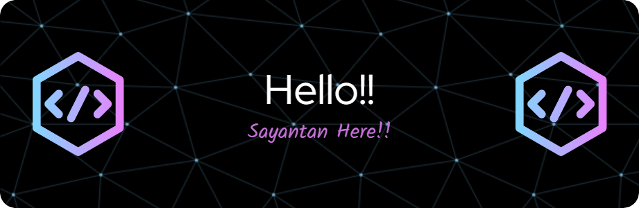

## 

<!--
**Arko298/Arko298** is a ✨ _special_ ✨ repository because its `README.md` (this file) appears on your GitHub profile.

Here are some ideas to get you started:

- 🔭 I’m currently working on ...
- 🌱 I’m currently learning ...
- 👯 I’m looking to collaborate on ...
- 🤔 I’m looking for help with ...
- 💬 Ask me about ...
- 📫 How to reach me: ...
- 😄 Pronouns: ...
- ⚡ Fun fact: ...
- 📄 Know about my experiences
-->
<h1 align="center">Hi 👋, I'm Sayantan Choudhury</h1>
<h3 align="center">A builder, dreamer, and constant learner. I love working on impactful projects across web, backend, cloud, and AI. Whether it's spinning up scalable servers, designing clean UIs, or diving into cutting-edge tech, I'm all in.</h3>

<!-- 
  
 -->

- 🌱 Currently Learning: ML, MLOps

- 👨‍💻 Portfolio: (https://my-portfolio-ten-bice-27.vercel.app/)

- 💬 Ask me about: **Backend Technologies.**
<!-- 📫 How to reach me: **** -->
- 🧠 Motto: *"Think Big. Build Fast. Learn Always."*
  

<!-- - ⚡ Fun fact: **Late,** -->

## Connect with me:

 
<!---->

<!---->

 

## Languages and Tools:
<h3 align="left">Prgramming Languages:</h3>

 
 
 
 
 
 

 <!--<h3 align="left">Frontend Development:</h3>

    
   
   
   
   
    --!>

<h3 align="left">Backend Development:</h3>

  
 
 
 
   
  
  
 
  

<h3 align="left">DevOps:</h3>

  

 

 
## Github Stats:

